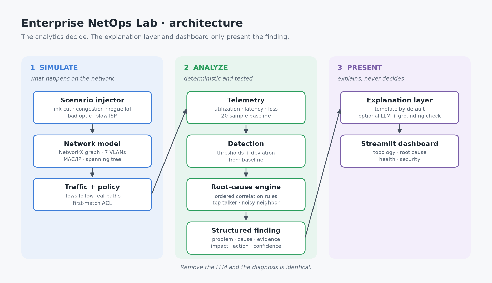
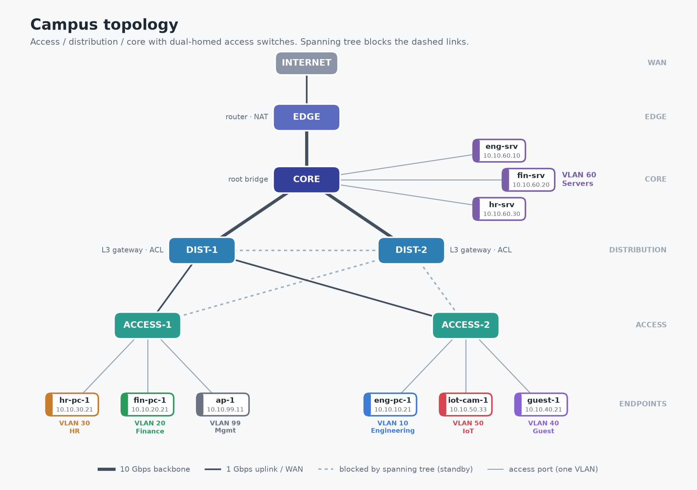

# AI-Assisted Enterprise Network Operations Lab

**🔗 Live demo:** https://rohithkm-enterprise-netops-lab.streamlit.app

A vendor-neutral **digital twin of an enterprise campus network** that you can break on purpose and have diagnosed automatically. It models switches, VLANs, subnets, ACLs and spanning tree; derives telemetry from simulated traffic; and uses a deterministic root-cause engine to explain what went wrong, who is affected and what to do. An optional LLM only rephrases the engine's finding.

> **The inputs are simulated; the reasoning is real.** Paths, failover, spanning tree, ACL decisions, utilization, latency, loss and root cause are all computed from the model. No dashboard number is random.

## Problem
Enterprise networks keep getting more complex, while troubleshooting stays slow and reactive. Admins face large volumes of telemetry, alerts that describe symptoms instead of causes, and separate tools for performance and security. Most problems are found when users complain.

## Customer
**Enterprise network administrator** at a mid-size organization (one campus, a few hundred to a few thousand users), plus the IT manager who needs the business impact and the security team who needs the policy view.

## Product Hypothesis
> If network telemetry can automatically identify probable causes and explain network problems in plain language, network administrators may reduce troubleshooting time and make faster operational decisions.

## Architecture


Everything up to the **structured finding** is analytics. The explanation layer and the dashboard only present it; remove the LLM and the diagnosis is identical.

## Enterprise Network Topology


## Networking Concepts Demonstrated
| Area | Concepts | Where |
|---|---|---|
| Architecture | Access / distribution / core, LAN vs WAN, dual-homing, single points of failure, blast radius | `topology.py`, `paths.py`, `resilience.py` |
| Layer 2 | MAC addresses, MAC learning, flooding, per-VLAN MAC tables, access vs trunk ports, 802.1Q, VLAN pruning | `inventory.py`, `switching.py` |
| Loops | Why Layer 2 loops are fatal, STP root election, path cost, blocked ports, reconvergence | `stp.py` |
| Layer 3 | IPv4, CIDR subnets, gateways, ARP, inter-VLAN routing, TTL, NAT | `addressing.py`, `packet_walk.py` |
| Layer 4 / services | TCP vs UDP, ports, DNS | `packet_walk.py` |
| Security | Segmentation, first-match ACLs, implicit deny, least privilege, lateral movement | `policy.py` |
| Operations | Flow-based utilization, queueing latency, loss, health status, baselines | `telemetry.py`, `health.py` |
| Analytics | Symptom detection, correlation rules, top talker, noisy neighbor, confidence | `rca.py` |

## VLAN Architecture
Each VLAN *N* uses `10.10.N.0/24`; the gateway is `.1` on the distribution layer.

| VLAN | Name | Subnet | Gateway |
|---|---|---|---|
| 10 | Engineering | 10.10.10.0/24 | 10.10.10.1 |
| 20 | Finance | 10.10.20.0/24 | 10.10.20.1 |
| 30 | HR | 10.10.30.0/24 | 10.10.30.1 |
| 40 | Guest | 10.10.40.0/24 | 10.10.40.1 |
| 50 | IoT | 10.10.50.0/24 | 10.10.50.1 |
| 60 | Servers | 10.10.60.0/24 | 10.10.60.1 |
| 99 | Management (switches, access points) | 10.10.99.0/24 | 10.10.99.1 |

## Security Model
Segmentation is enforced by a first-match ACL on the gateway, which every cross-VLAN packet must pass. Anything not explicitly allowed hits the implicit deny.

| Flow | Result | Why |
|---|---|---|
| Engineering / Finance / HR → own department server (443) | ALLOW | explicit rule |
| Engineering → Finance server | DENY | implicit deny (least privilege) |
| Guest → any internal system | DENY | `guest-no-internal` |
| IoT camera → Finance | DENY | `iot-no-internal` |
| IoT camera → internet | DENY | implicit deny |
| Guest → internet | ALLOW | `guest-to-internet` |
| Server → server in the same VLAN | **not inspected** | never reaches the gateway |

The last row is a deliberate finding: VLAN-plus-ACL segmentation cannot see traffic inside a VLAN and is tied to IP ranges rather than identity. That gap is what microsegmentation, identity-based access and Zero Trust architectures address.

## AI / Root Cause Analysis
The engine (`netops/rca.py`) is deterministic and testable:
1. **Detect** symptoms: threshold breaches, deviation from the baseline, loss without load, latency without load, blocked flows, degraded user experience.
2. **Correlate** with ordered rules: link down → compromised device (blocked flows + congestion) → unauthorized access → physical fault → provider issue → congestion (with top talker and noisy-neighbor detection).
3. **Report** a finding with problem, likely cause, evidence (compared with normal), business impact, recommended action and confidence.

Example (`congested_uplink`):
```
PROBLEM:            Engineering and Guest users are experiencing degraded connectivity.
LIKELY CAUSE:       ACCESS-2<->DIST-1 is saturated; the top flow is eng-pc-1 -> eng-srv (huge-transfer, 450.0 Mbps, 47% of the load).
EVIDENCE:           95.8% vs normal 51.2% ± 2.9 · 12.2% loss for Engineering
RECOMMENDED ACTION: Rate-limit or reschedule the huge-transfer flow from eng-pc-1; review capacity on ACCESS-2<->DIST-1 if this repeats.
CONFIDENCE:         High
```
**The LLM layer** (`netops/explain.py`) is optional. It receives only the finding as JSON, is instructed to use only those facts, and its reply is rejected if it contains any number not present in the finding. Without an API key, or on any error, a template summary is used.

## Installation
Requires Python 3.10+.
```bash
git clone <your-repo-url> enterprise-netops-lab
cd enterprise-netops-lab
python3 -m venv .venv && source .venv/bin/activate      # Windows: .venv\Scripts\Activate.ps1
pip install -r requirements.txt
python -m pytest -q
```
Optional LLM phrasing: `pip install anthropic` and set `ANTHROPIC_API_KEY`.

## Running the Application
```bash
streamlit run app/dashboard.py          # dashboard at http://localhost:8501
python -m netops.scenarios              # all scenarios, text summary
python -m netops.rca                    # every diagnosis + accuracy
python -m netops.packet_walk            # hop-by-hop packet journey
python -m netops.stp                    # spanning tree: designed, default, failover
```

## Demo Scenarios
| Scenario | What breaks | Engine's diagnosis |
|---|---|---|
| `link_failure` | ACCESS-2↔DIST-1 cable cut | Link down; users unaffected thanks to STP failover; **redundancy lost** |
| `congested_uplink` | 450 Mbps Engineering transfer | Uplink saturated; top flow named; Guest hit as a neighbor |
| `abnormal_traffic` | Guest pulls 700 Mbps | Noisy neighbor: Guest traffic degrading Engineering |
| `unauthorized_access` | Guest probes the finance server on 4 ports | Unauthorized access attempt, fully blocked, no impact |
| `rogue_iot` | Compromised camera scans servers and calls out | **Compromised device**: blocked by ACL but still saturating its uplink → quarantine |
| `packet_loss` | Faulty optic, 8% loss at 17.5% load | Physical fault, not congestion |
| `high_latency` | Provider routing problem, +150 ms | Provider issue; internal apps unaffected |


## Product Metrics
| Metric | What it measures | In this project |
|---|---|---|
| Diagnosis accuracy | Correct culprit vs known ground truth | **8/8 scenarios** (tested) |
| MTTD | Problem start → detection | Baseline deviation flags anomalies below fixed thresholds |
| MTTI | Detection → cause identified | Finding produced immediately with evidence |
| MTTR | Cause → resolution | Specific recommended action per finding |
| False-positive rate | Alerts on a healthy network | 0 findings on `normal` (tested) |

See [docs/PRD.md](docs/PRD.md) for personas, requirements, prioritization and targets.

## Limitations
- Simulated inputs: traffic volumes, the latency/loss curve and hardware faults are modeled, not measured.
- Spanning tree is computed as a single tree (not per VLAN), and its outcome is calculated rather than its timers replayed.
- No wireless, QoS queues, first-hop redundancy, dynamic routing (OSPF/BGP) or real device APIs.
- The rule set covers the scenarios it was designed for; novel failure patterns would need new rules or anomaly models.

## Future Roadmap
- **Next:** time-series telemetry with trend-based capacity forecasting; multiple simultaneous faults; per-VLAN spanning tree.
- **Later:** ingest real telemetry (streaming telemetry, flow export) from lab devices; identity/group-based policy model; natural-language questions over the finding history; closed-loop remediation with human approval.

## What I Learned
- Why campus networks use access/distribution/core layers, and how redundancy creates loops that spanning tree must tame.
- That VLANs separate traffic but the **gateway ACL** is what enforces policy, and why same-VLAN traffic is a blind spot.
- That users feel **latency and loss**, not utilization, and that baselines catch "unusual" where fixed thresholds only catch "high."
- That the valuable part of "AI for networking" is **trustworthy diagnosis**; language models are best used to explain, with guardrails.
- How these technical capabilities map to customer outcomes: faster time to identify, fewer false alarms, and clear business impact.

---
*Vendor-neutral educational project. Not affiliated with any network vendor.*